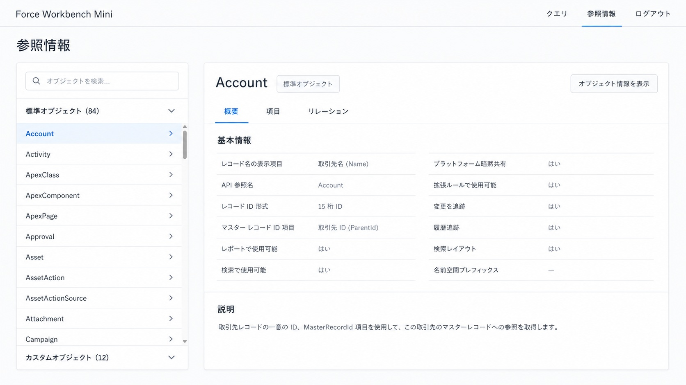
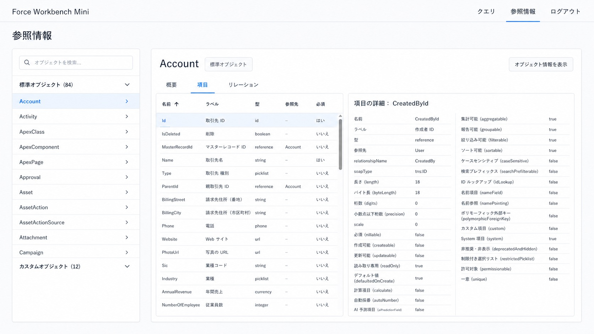

# 参照情報画面 UI 改善仕様

## 目的

Salesforce Workbench 風のオブジェクト参照画面を、既存アプリのミニマルなUIテイストに合わせて改善する。

## 対象画面

Force Workbench Mini の「参照情報」画面。

## 参考画像

左パネルからオブジェクトを選択し、右側にオブジェクト概要を表示する画面

「項目」タブ選択時に、左側に項目一覧、右側に選択項目の属性詳細を表示する画面

## 共通レイアウト

- トップバー左に `Force Workbench Mini`
- トップバー右に `クエリ`, `参照情報`, `ログアウト`
- `参照情報` をアクティブ表示する
- ページタイトルは `参照情報`
- 全体は白背景、薄い罫線、余白多め、控えめな青アクセントで統一する
- データベース風アイコンは表示しない

## 左パネル

- 左側にオブジェクト選択パネルを配置する
- 上部に検索ボックスを配置する
- セクションは以下とする
  - `標準オブジェクト (84)`
  - `カスタムオブジェクト (12)`
- `Account` を選択状態にする
- オブジェクト行にはアイコンを表示しない
- 各行右端に chevron を表示してよい

## 削除する要素

- トップのオブジェクト選択コンボボックスは表示しない
- 右側オブジェクト詳細エリアのヘッダ直下に、API名・ラベル・種別・項目数・子リレーション数・説明などのサマリ行を表示しない
- データグリッドのページャー、rows per page、件数フッターは表示しない

## 右側エリア

### ヘッダ

- オブジェクト名 `Account` を表示する
- `標準オブジェクト` バッジを表示する
- 右上に `オブジェクト情報を表示` ボタンを表示する

### タブ

- `概要`
- `項目`
- `リレーション`

## 概要タブ

`概要` タブでは、すぐに `基本情報` を表示する。

表示例:

- レコード名の表示項目: 取引先名 (Name)
- API 参照名: Account
- レコード ID 形式: 15 桁 ID
- マスター レコード ID 項目: 取引先 ID (ParentId)
- レポートで使用可能: はい
- 検索で使用可能: はい
- プラットフォーム暗黙共有: はい
- 拡張ルールで使用可能: はい
- 変更を追跡: はい
- 履歴追跡: はい
- 検索レイアウト: はい
- 名前空間プレフィックス: ―

下部に `説明` セクションを表示する。

## 項目タブ

`項目` タブでは、右側エリア内を左右2ペインに分割する。

### 左ペイン: 項目一覧

主要属性のみをテーブル表示する。

列:

- 名前
- ラベル
- 型
- 参照先
- 必須

仕様:

- ページャーは表示しない
- rows per page は表示しない
- 件数フッターは表示しない
- 最大1000件程度を想定し、スクロールで全件確認できるようにする
- 行クリックで選択項目を切り替える
- 選択行は薄い青背景で表示する

### 右ペイン: 項目詳細

選択された項目の全属性を key-value 形式で表示する。

例: `CreatedById` 選択時

- 名前: CreatedById
- ラベル: 作成者 ID
- 型: reference
- 参照先: User
- relationshipName: CreatedBy
- soapType: tns:ID
- 長さ (length): 18
- バイト長 (byteLength): 18
- 桁数 (digits): 0
- 小数点以下桁数 (precision): 0
- scale: 0
- 必須 (nillable): false
- 作成可能 (createable): false
- 更新可能 (updateable): false
- 読み取り専用 (readOnly): true
- デフォルト値 (defaultedOnCreate): true
- 計算項目 (calculated): false
- 自動採番 (autoNumber): false
- AI 予測項目 (aiPredictionField): false
- 集計可能 (aggregatable): true
- 報告可能 (groupable): true
- 絞り込み可能 (filterable): true
- ソート可能 (sortable): true
- ケースセンシティブ (caseSensitive): false
- 検索プレフィックス (searchPrefilterable): false
- ID ルックアップ (idLookup): false
- 名前項目 (nameField): false
- 名前参照 (namePointing): false
- ポリモーフィック外部キー (polymorphicForeignKey): false
- カスタム項目 (custom): false
- System 項目 (system): true
- 非推奨・非表示 (deprecatedAndHidden): false
- 制限付き選択リスト (restrictedPicklist): false
- 許可対象 (permissionable): false
- 一意 (unique): false

## 実装方針

- 既存のコンポーネント、型定義、API取得処理を優先して使う
- 新しいUIライブラリは追加しない
- 既存でMUIを使っている場合はMUIベースで実装する
- 最小限の変更で実装する
- 型エラー、lintエラー、buildエラーを確認する

## 完了条件

- トップのオブジェクト選択コンボボックスがない
- 左パネルからオブジェクト選択できる
- データベースアイコンがない
- 右側ヘッダ直下にオブジェクト概要サマリ行がない
- `概要` タブが参照画像に近い
- `項目` タブが参照画像に近い
- 項目一覧にページャーがない
- 選択項目の属性詳細が右側に表示される
- プロジェクト既定の検証コマンドが成功する
