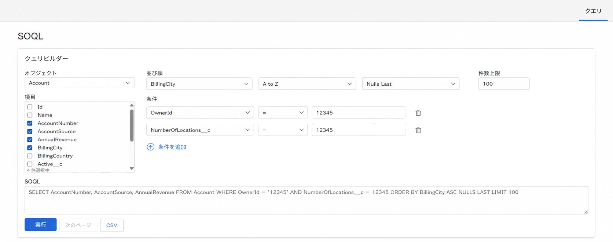

以下のUI画像を参考に、SOQLクエリ実行画面のUIを改善してください。
目的は、移植元バージョンのクエリビルダー機能を、新バージョンのトンマナに合わせて移植することです。

## 前提

- 既存の新バージョンUIのデザインテイストを維持すること
- 既存のコンポーネント構成・状態管理・API呼び出しを尊重し、最小限の変更で実装すること
- 既存で使っているUIライブラリがあればそれを利用すること
- まず関連ファイルを調査し、実装方針を簡潔に説明してから作業すること

## 実装目的

新バージョンのSOQL画面に、移植元バージョンで提供していた以下のクエリビルダー機能を移植する。

### 移植対象機能

- オブジェクト選択
- フィールド選択
- ソート項目
- 件数上限
- 条件（複数条件を追加可能な形式）

### 移植元バージョンソース

`./work/reference/workbench`

## 変更しない点

- クエリ実行結果のテーブル（グリッド）は既に実装済みであり、今回の変更対象外です
- クエリ結果グリッドのUI・列構成・表示方法・スタイルは変更しないこと
- 必要であれば、既存グリッドの上にクエリ入力エリアを配置・調整してよいが、グリッド自体には手を入れないこと

## 画面レイアウト要件

新バージョンのトンマナに合わせて、以下のような構成にすること。

### 全体

- ページ見出しは `SOQL`
- 上部にクエリビルダー領域を配置
- その下に既存のクエリ入力エリア（SOQLテキストエリア）を配置
- さらにその下に、既存実装済みのクエリ結果グリッドが表示される構成にする
- 白背景、薄い罫線、余白多め、フラットでミニマルな新UIに合わせること

### クエリビルダー領域

1. オブジェクト選択
   - 単一選択のコンボボックス
   - 例: `Account`
   - デフォルト: 選択なし

2. フィールド選択
   - 複数選択可能な一覧UIを利用する
   - チェックボックス付きのスクロール可能リスト
     - MUIのMultiple Select(https://v6.mui.com/material-ui/react-select/#checkmarks)
   - 選択済件数は表示不要
   - 選択内容がSOQLに反映されること

3. ソート設定
   - ソート対象項目の選択
   - 昇順/降順の選択
   - Nulls First / Nulls Last の選択
   - これらを横並び、または自然なまとまりで配置すること

4. 件数上限
   - 数値入力欄
   - 例: `100`
   - SOQLの `LIMIT` に反映されること

5. 条件
   - 複数条件を追加可能にする
   - 1条件ごとに以下を持つこと
     - 項目選択
     - 演算子選択
     - 値入力
     - 条件削除
   - `条件を追加` ボタンで行追加できること
   - AND 条件の追加を自然に扱えるUIにすること
   - 高度なOR条件対応は不要。既存仕様に無ければ無理に追加しないこと

### SOQL入力エリア

- クエリビルダーで選んだ内容をもとに、SOQL文字列が入力欄に反映されること
- 実行ボタンは既存仕様に合わせること
- SOQLは、ユーザーが直接編集することも可能

## サンプル状態

初期表示またはサンプル状態として、以下のような内容が分かるとよい。

- オブジェクト: `Account`
- 選択フィールド:
  - `AccountNumber`
  - `AccountSource`
  - `AnnualRevenue`
  - `BillingCity`
- 並び順:
  - 項目: `BillingCity`
  - 方向: `A to Z` または `ASC`
  - Null順: `Nulls Last`
- 件数上限:
  - `100`
- 条件:
  - `OwnerId = '12345'`
  - `NumberOfLocations__c = 12345`

この内容から、以下のようなSOQLが組み立てられるイメージにすること。

SELECT AccountNumber, AccountSource, AnnualRevenue
FROM Account
WHERE OwnerId = '12345'
AND NumberOfLocations\_\_c = 12345
ORDER BY BillingCity ASC NULLS LAST
LIMIT 100

## デザイン要件

- 新バージョンの画面に自然に馴染む見た目にすること
- 旧Workbench風の強い装飾は持ち込まないこと
- セクション見出し、入力欄、ボタン、余白、境界線を整理し、現代的で見やすいUIにすること
- 設定領域はカードまたはセクションで分け、視認性を高めること
- クエリビルダー領域は、情報量が多くても圧迫感が出ないように整理すること

## 実装時の注意

- 既存のクエリ結果グリッドには変更を加えないこと
- 既存のデータ取得・クエリ実行ロジックを壊さないこと
- UI変更対象は主に、クエリ入力周辺のビルダー部分のみとすること
- 既存の状態管理に合わせ、過剰な再設計は避けること
- 新しい依存ライブラリは、必要性が高い場合を除き追加しないこと

## 作業手順

1. 対象画面と関連コンポーネントを調査
2. 移植元バージョンを調査し、クエリービルダーアルゴリズムを調査
3. 変更対象ファイルと変更方針を説明
4. クエリビルダーUIを実装
5. SOQL入力欄との連動を実装
6. クエリ結果グリッドには変更が入っていないことを確認
7. 型チェック、lint、build など可能な検証を実施

## 完了条件

- 新バージョンのSOQL画面に、移植元バージョン相当のクエリビルダー機能が追加されている
- 以下の機能が使える
  - オブジェクト選択
  - フィールド選択
  - ソート項目設定
  - 件数上限設定
  - 条件追加
- クエリ実行結果グリッドは既存のままで、UI変更されていない
- 画面全体のトンマナは新バージョンに揃っている
